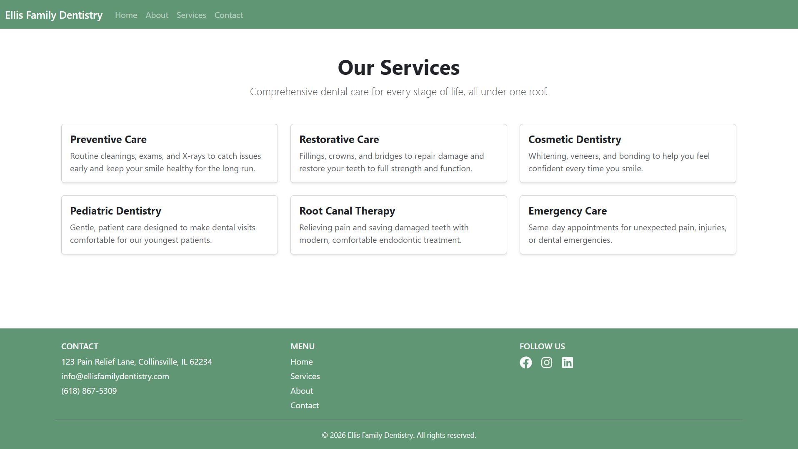

# Dental Office Website (Portfolio Project)

A modern, responsive dental practice website built as a portfolio piece to demonstrate front-end development skills using React, React-Bootstrap, and custom CSS.

> **Note:** This is a **frontend-only** project. It is a mock/demo site built for portfolio purposes and is not connected to a real dental practice or a live backend server. Any contact form functionality is illustrative and does not send real data unless explicitly configured with a service like Formspree.

---

## Services Page Preview



---

## Tech Stack

- **React** — component-based UI library, built with [Vite](https://vitejs.dev/)
- **React-Bootstrap** — Bootstrap components rebuilt for React, used for layout and UI elements (Navbar, Cards, Forms, Buttons, etc.)
- **React Router** — client-side routing for multi-page navigation (Home, Services, About, Contact)
- **Custom CSS** — a small custom stylesheet (`custom.css`) layered on top of Bootstrap to apply a warm, cozy color palette
- **react-icons** — social media icons (Facebook, Instagram, LinkedIn) in the footer

This project intentionally has **no custom backend**. It is built and deployed as a static site.

---

## Features

- Responsive multi-page layout (Home, Services, About, Contact) using React Router
- Reusable, prop-driven components (service cards, team member cards) built with `.map()` over data arrays rather than hardcoded repetition
- Custom color theme (`btn-warm`, `bg-warm`) layered on top of Bootstrap's default styles
- Consistent Navbar and Footer across all pages, with a footer that includes contact info, page menu links, and social icons
- Contact form built with controlled state via a custom hook (`useContactForm`), demonstrating separation of logic from markup

---

## Getting Started

Clone the repository and install dependencies:

```bash
git clone <https://github.com/hearyoume/dental-office.git>
cd <dental-office>
npm install
```

Run the development server:

```bash
npm run dev
```

---

## Deployment

This project is deployed as a static site (e.g., via [Netlify](https://www.netlify.com/)). Since there is no backend, it can be hosted on any static hosting provider (Netlify, Vercel, GitHub Pages, etc.) with no additional server configuration required.

---

## Future Improvements

- Connect the contact form to a real email delivery service (e.g., Formspree) or a custom backend
- Add individual detail pages for each service (e.g., `/services/preventive`)
- Add real photography and content once/if paired with an actual practice

---

## Author

Built by Amanda as a portfolio project to demonstrate front-end development skills.
